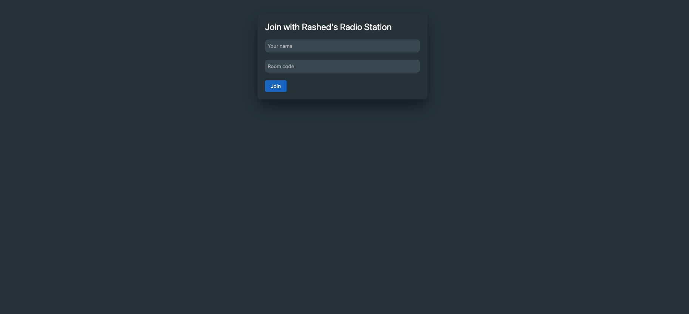

# Radio Streaming Using 100ms

Radio Streaming Using 100ms is an application that allows users to listen to live radio broadcasts with minimal delay. By leveraging low-latency technology, the application achieves a delay of only 100 milliseconds, providing a seamless and real-time streaming experience.

## Key Features

- **Low Latency**: The application utilizes advanced technology to minimize the delay between the radio station's broadcast and the user's reception to just 100 milliseconds.
- **Real-Time Streaming**: Users can enjoy live radio broadcasts in real-time without noticeable delays or interruptions.
- **Multi-Platform Support**: The application is compatible with desktop, web, and mobile platforms, ensuring accessibility and convenience for users.
- **User-Friendly Interface**: The interface is designed to be intuitive and easy to navigate, allowing users to browse and select their favorite radio stations effortlessly.
- **Station Favorites**: Users can create a list of their preferred radio stations, making it convenient to switch between different channels.
- **High-Quality Audio**: The application ensures that audio quality is maintained throughout the streaming process, delivering a clear and immersive listening experience.
- **Customization Options**: Users can personalize their streaming experience by adjusting settings such as volume, equalizer, and audio quality according to their preferences.
- **Robust Backend**: The project includes a robust backend infrastructure that efficiently handles streaming requests, ensures smooth playback, and supports a large number of concurrent users.

## Demo 



### Prerequisites

- [Node.js](https://nodejs.org) (version X.X.X)
- [npm](https://www.npmjs.com/) or [yarn](https://yarnpkg.com/) package manager

### Installation

1. Clone the repository:

```bash
   git clone https://github.com/jmrashed/radio-streaming-100ms.git
```
2. Change to the project directory:
```bash
cd radio-streaming-100ms
```

3. Install the dependencies:

```bash
npm install
# or
yarn install
```

4. Start the application:
```bash
npm start
# or
yarn start
```

5. Open your preferred web browser and visit http://localhost:3000 to access the application.


# Contributing
Contributions are welcome! If you find any issues or have suggestions for improvements, please submit an issue or create a pull request.

# License
This project is licensed under the MIT License.
